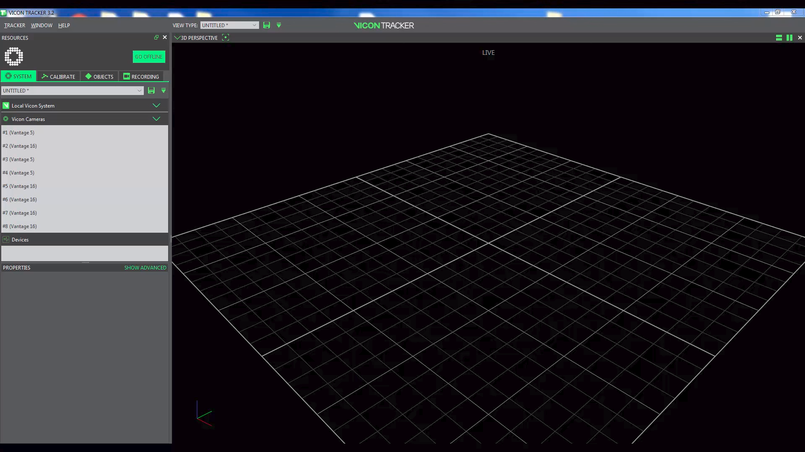

Motion Capture System
======================

This section details setting up `Vicon <https://www.vicon.com/>`_ motion capture system and quadcopters for capturing their position and orientation information at the flight arena in `Intelligent Robotics Laboratory <https://robotics.illinois.edu/>`_. Motion capture systems like Vicon use multiple high frame rate cameras to capture light of a pre-defined frequency either directly from active sources or light from passive strobes reflected by markers mounted on object of interest. The flight arena at IRL is covered by eight T40 Vicon cameras which are capable of streaming millimeter level position and orientation data at upto 350 frames per second with very little latency. We begin by describing essentials of the Tracker, a proprietary software used by Vicon for data processing and visualization and then go on to setting up markers on objects of interest and streaming their positional data to MATLAB or ROS.

Tracker3 Essentials
---------------------
`Tracker <https://www.vicon.com/products/software/tracker>`_ is the proprietary tool of Vicon designed for engineering applications. Tracker3 is the current version and is installed in the host PC available at flight arena in IRL. We describe the essential components of Tracker3 in the following sections.

Quick Start
***************
* Login to the PC with your NetID and password and open the Tracker3 software on the desktop.

* Initiate the Vicon system by turning on the smart box (black box with a blue power switch) placed beside the host PC.

* Once all the cameras go online (as indicated at Resources > System > Vicon Cameras), use space button to pause or start live data streaming on the *view* pane. Note that pausing here would also turn off the broadcast in local network.

* In *Objects* tab in the *Resources* pane of Tracker, select the object(s) that need to be tracked, and turn on the *Track* mode located at the bottom of the tab.

* If you are adding a new object, **turn off** the *Track* mode and then select the markers in the view pane using *alt + left click* and then click on *Create* button in the *Objects* tab after selecting an appropriate name. Save the object by *right clicking* on the created object in the list and selecting the *sav* option. For advanced options, refer the complete Tracker manual `here <https://docs.vicon.com/download/attachments/25296959/Vicon%20Tracker%20User%20Guide.pdf?version=1&modificationDate=1466182606000&api=v2>`_.

* After selecting the object of interest, start the broadcast by using *space* button. If required, the session can be recorded and replayed using the *Recording* tab in the *Resources* pane. The data can also be exported as a *.csv* file if required.

* Once the session is live, the tracking data is previewed in the *view* pane and is also simultaneously broadcasted over local network which can be accessed in ROS, MATLAB or any other framework that the Vicon SDK supports.

* For detailed information and advanced topics, including changing object's local frame, re-calibrating the arena, adjusting frame-rate or broadcast settings, please refer to the manual of Tracker3 `here <https://docs.vicon.com/download/attachments/25296959/Vicon%20Tracker%20User%20Guide.pdf?version=1&modificationDate=1466182606000&api=v2>`_.

.. note::
    * The LED strobe lights on Vicon cameras have a certain life time. To prolong the service of Vicon instruments, if the Vicon cameras are not being used for data acquisition for longer than 45 min, the cameras should be turned off; the computer which controls the Vicon cameras can be left on to maintain your work state.
    * Do not change or delete the calibration settings unless you are trained and allowed to re-calibrate the arena. The arena is regularly re-calibrated by the IRL lab manager. In case you need to re-calibrate, please take prior permission from the lab manager.
    * Do not fly closer than two meters to any of the Vicon cameras in the arena.

Markers Setup
--------------

Vicon system requires either active or passive markers on objects of interest  to act as indicators of its three dimensional position and orientation. These markers could either be *active* markers which are essentially LEDs of appropriate wavelength mounted directly on the objects with a power source to act as reference points for active tracking or could be retro-reflective markers which reflect the incoming light from strobes back to the cameras. A well thought of marker setup is essential for maintaining reliable and accurate tracking. The following are a few general guidelines that must be kept in mind while setting up markers (active or passive) on objects of interest:

* At least three markers are required for tracking objects 6DOF. It's always preferable to have more markers as they are likely to be occluded in motion with rapid maneuvers.

* Markers must be firmly fixed on the object as any distortion in the relative position of the markers would lead to difficulty in accurately tracking the object.

* Its essential to have an asymmetric arrangement of the markers to avoid confusion between marker labels. Avoid any shape that could lead to ambiguity in recognizing the markers for tracking in terms of orientation or position.

* Ensure that the object of interest has minimal reflective surfaces by covering all shiny surfaces using non-reflective tapes.

Passive Markers
***************
* The size of the marker completely depends on the size of the object of interest. It's always preferable to have the largest possible marker that could be fixed on our object as smaller markers are more likely to be occluded.

* Ensure that the retro-reflective surfaces are well-maintained and replace the marker whenever it shows any signs of wear.

Active Markers
**************

* Ensure that the wavelength of the LED matches with the wavelength of the band-pass filter that is attached to your motion capture cameras. In case of the Vicon system at IRL, the system works at 780 nm wavelength and the LEDs used in the active markers should emit the same.

* Adding a spherical diffuser on each LED marker will help increase the illumination angle and tracking accuracy as they LEDs by default have limited illumination angles due to their narrow beamwidth.

Troubleshooting
----------------

* If Tracker3 refuses to startup, restart the PC as there could be an active Tracker session running in the account of a different user who failed to logout.

* If the Tracker refuses to recognize a saved object, ensure that the 'Track Mode' is turned on and if the problem still persists, delete the object and re-save it by disabling the 'Track Mode'.
